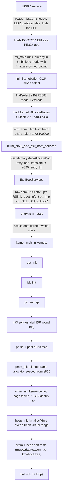
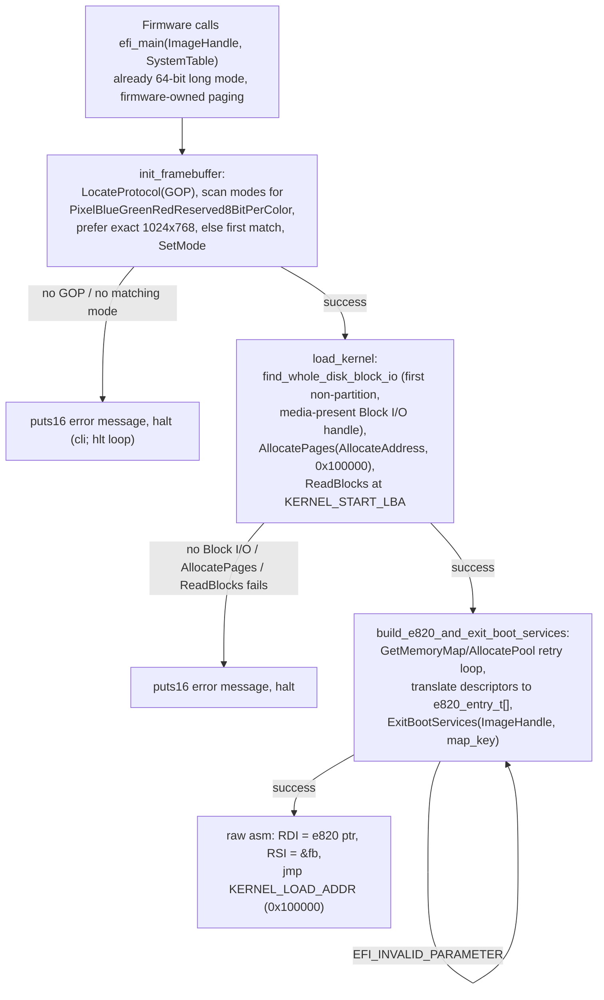
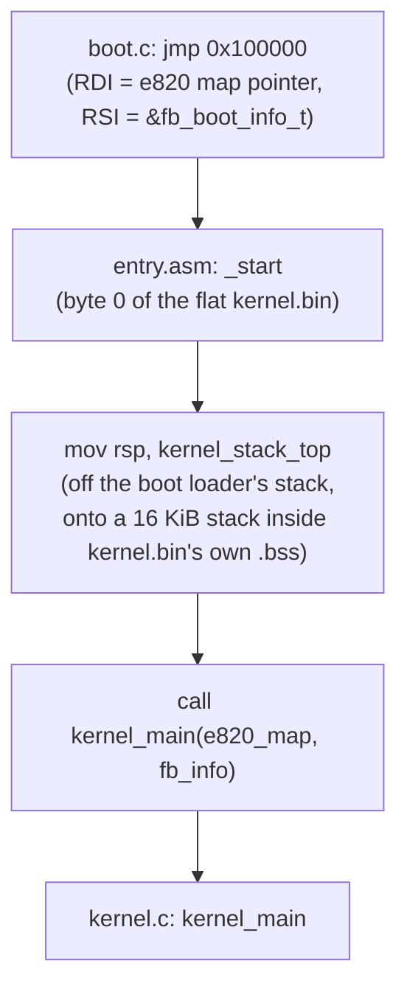
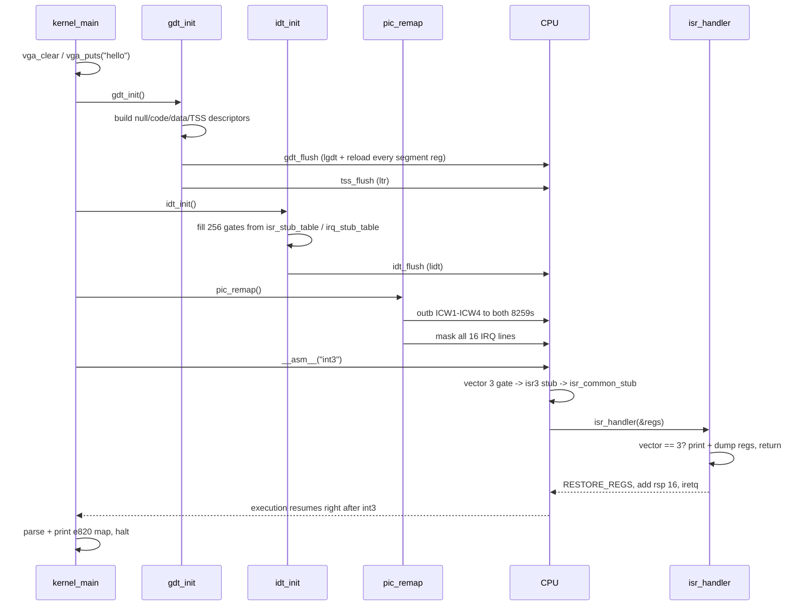
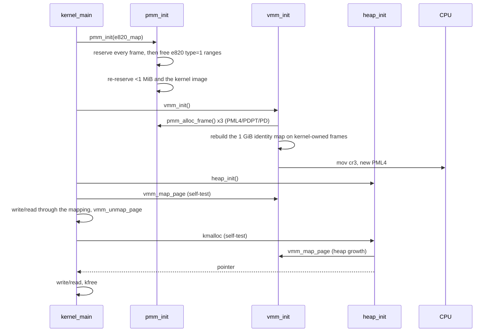
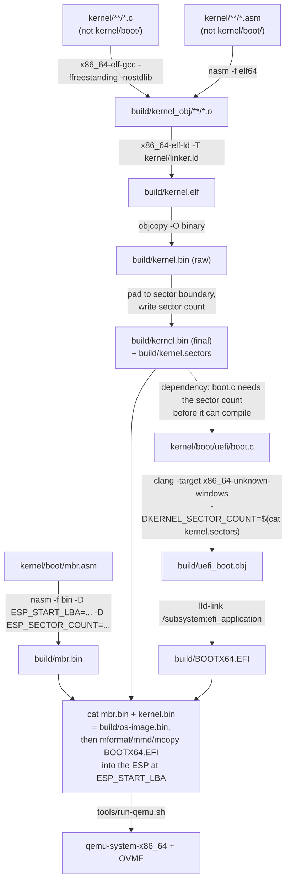

# Boot & kernel bring-up: the full flow

This is a tutorial-style walkthrough of everything that happens between
"QEMU powers on" and "the kernel halts after standing up memory
management" — i.e. everything built through **M5** (see
[milestones.md](../milestones.md)). It intentionally stops there rather
than trying to keep pace tutorial-section-by-tutorial-section with every
later milestone; `milestones.md`'s dated progress log is the up-to-date,
authoritative account of M6 onward (drivers/timer, scheduler, syscalls,
user mode, filesystem, shell, ...) - this doc's boot-to-memory-management
walkthrough stays valid background reading regardless of how far past it
the project has gone.
Each section has a diagram plus a "why" explanation: nothing here is
architecture for its own sake, every hop exists because of a concrete
hardware constraint. Read it top to bottom if you're new to OS dev; jump
to a section if you just need a refresher.

---

## 1. The big picture

Everything below is one of the boxes in this diagram, expanded.

---

## 2. Why a UEFI application instead of a hand-rolled bootloader

Early on, `lean_os` booted via a from-scratch two-stage BIOS bootloader
(a 512-byte MBR loading a larger real-mode-to-long-mode stage 2 - see
M1/M2 in [milestones.md](../milestones.md)). M24 added a UEFI path
alongside it, and M26 removed the BIOS path entirely, leaving UEFI as the
only boot method. The reasoning: UEFI firmware already does, as spec'd
services, everything the hand-written BIOS stages had to build from raw
real-mode primitives - a memory map (`GetMemoryMap`), a linear framebuffer
mode (Graphics Output Protocol), disk access (`EFI_BLOCK_IO_PROTOCOL`),
and crucially, it hands control to `efi_main` **already in 64-bit long
mode** with its own paging live. There's no A20 gate, no hand-built GDT,
no protected-mode/long-mode transition to get right - all of that is the
firmware's problem, not this project's.

What UEFI does *require* in exchange: the boot loader has to be a PE32+
application (not a flat binary), built and linked with a different
toolchain (`clang -target x86_64-unknown-windows` + `lld-link` - see
[docs/toolchain.md](toolchain.md)), calling into firmware through function
pointers off an `EFI_SYSTEM_TABLE` rather than software interrupts. The
project still writes this from scratch, no GNU-EFI or edk2 headers linked
in (`kernel/boot/uefi/efi.h`/`efi_proto.h`, [source](../kernel/boot/uefi/) hand-match the spec's own ABI) -
same "no third-party boot code" ground rule as the original BIOS path, just
built against a different, firmware-provided foundation.

The disk image still needs a legacy MBR at LBA 0 even with no BIOS left to
read it: QEMU/OVMF's boot manager, finding no GPT, scans the legacy MBR
partition table for an entry of type `0xEF` (EFI System Partition) and
boots the FAT filesystem there. `kernel/boot/mbr.asm` ([source](../kernel/boot/mbr.asm))
is exactly that partition table and nothing else - no boot code, since
nothing ever executes this sector as code anymore.

---

## 3. `efi_main`: firmware hands off, `boot.c` takes over

**Why the framebuffer is set up before the kernel is even loaded:** no
particular ordering constraint here - `efi_main` just does the two
firmware-service steps (graphics, then disk) before the one step that
ends firmware services (`ExitBootServices`) for good, printing status via
`puts16` along the way the same way stage1 used to print via `INT 10h`
teletype: cheap insurance that shows exactly how far boot got before any
real diagnostics (VGA/framebuffer console, panic handler) exist.

### 3.1 `init_framebuffer` — why BGR8888, and why "first match" is an acceptable fallback

The Graphics Output Protocol enumerates modes via `QueryMode`, each
reporting a `PixelFormat`. `fb.c` (M16) only understands one 32bpp
packed layout, and `PixelBlueGreenRedReserved8BitPerColor` is the GOP
mode whose byte layout (`[0]=Blue [1]=Green [2]=Red [3]=Reserved`), read
as a little-endian `uint32`, is bit-for-bit the same value fb.c already
treats as `0x00RRGGBB` - see `efi_proto.h`'s comment on that enum value.
Among modes in that format, an exact 1024x768 match is preferred (a nice
round default), but the *first* matching mode at all is taken if that
exact resolution isn't offered - a working framebuffer at some resolution
beats refusing to boot because the preferred one doesn't exist on this
firmware. `fb_init` (kernel-side) reads whatever width/height/pitch
actually got reported and adapts, so there's no hardcoded resolution
assumption downstream.

### 3.2 `load_kernel` — why raw Block I/O instead of reading BOOTX64.EFI's own filesystem

`kernel.bin` deliberately lives **outside** the ESP's FAT filesystem, at
a fixed LBA (`KERNEL_START_LBA`, right after the single MBR sector - see
§5's build-pipeline section for exactly how that image is assembled).
Reading it means going around the filesystem entirely: `find_whole_disk_block_io`
locates the *whole-disk* `EFI_BLOCK_IO_PROTOCOL` handle (not the ESP
partition's own child handle this application was loaded from -
`!bio->Media->LogicalPartition` is the check), then `ReadBlocks` pulls
`KERNEL_SECTOR_COUNT` sectors straight from that fixed LBA into memory
reserved at exactly `0x100000` via `AllocatePages(AllocateAddress, ...)`.
No FAT driver, no filename lookup - the same "kernel isn't reached
through a filesystem, just a fixed disk offset" design the original BIOS
stage2 used, kept because nothing about it needed to change: it's simpler
than teaching this loader to parse FAT, and the Makefile already has to
track `KERNEL_SECTOR_COUNT` precisely for other reasons (padding
`kernel.bin` to a sector boundary).

### 3.3 `build_e820_and_exit_boot_services` — why this is the trickiest function in the file

Two UEFI rules collide here. First: `GetMemoryMap` returns a `MapKey`
that `ExitBootServices` must be called with, but that key is invalidated
by *any* allocation or free that happens afterward - including the pool
allocations this function itself needs to size its own scratch buffers.
So the loop's rule is strict: the moment `AllocatePool`/`FreePool`/
`GetMemoryMap` runs, `continue` back to the top and re-fetch a fresh map
and key - nothing (not even a console print, since `ConOut`'s own driver
is free to allocate) may run between the `GetMemoryMap` call that produces
the `MapKey` actually passed to `ExitBootServices` and that call itself.
Both scratch buffers (`map`, the raw UEFI descriptors, and `e820`, the
translated output) are sized with `MAP_SLACK_DESCRIPTORS` of headroom so
a *second* growth pass is unlikely, but the loop handles it correctly
either way.

Second: `ExitBootServices` can itself return `EFI_INVALID_PARAMETER` if a
registered notification callback perturbed the memory map as a side
effect of the call - spec-anticipated, and why every real UEFI OS loader
(this one included) just loops and re-fetches on that specific error
rather than treating it as fatal.

Each surviving UEFI memory type is translated to a firmware-agnostic
one of five e820 types (M90: usable, reserved, ACPI reclaim, ACPI NVS, or
this project's own "MMIO" for a range that is not memory at all —
`kernel/mm/e820.h` explains why that last one had to exist before the
identity map could be built from this table). `EfiLoaderCode`/`EfiLoaderData`/
`EfiBootServicesCode`/`EfiBootServicesData`/`EfiConventionalMemory` count
as usable; everything else reserved) - producing the exact same
`{count, entries[]}` shape `kernel/mm/e820.h` already defines, which is
what lets `kernel.c`/`pmm.c` stay completely unaware of which boot path
produced it.

### 3.4 The final jump — why raw assembly, not a C call

By the time `ExitBootServices` succeeds, **no firmware call is safe
anymore** - `ConOut`, `BootServices`, all of it stops existing the instant
that call returns. The jump into `kernel_main` is hand-written assembly,
not a C function call, for a calling-convention reason: this entire file
(including `efi_main` itself) is compiled `ms_abi`, the calling convention
every UEFI firmware call requires, but the kernel image was built as an
ordinary System V ELF64 (`kernel/linker.ld`) and knows nothing about
`ms_abi`. The three-instruction stub explicitly loads `RDI`/`RSI` (System
V's first and second integer-argument registers) and jumps to
`KERNEL_LOAD_ADDR`, sidestepping the calling-convention mismatch
entirely rather than trying to make one C function honor two ABIs at
once.

---

## 4. Kernel entry: from `_start` to `kernel_main`

**Why switch stacks immediately?** Up to this point, execution has been
running on whatever stack the boot loader set up (UEFI firmware's own, by
the time `ExitBootServices` has run) — memory that belongs to the *boot
loader*, not the kernel. Once M5's physical frame allocator exists, it
needs to know which pages are already spoken for so it doesn't hand them
out as free RAM. A stack living inside the kernel's own linked image
(`.bss`, reserved by `linker.ld`) is memory the allocator can see and
account for; the boot loader's stack is not. So the very first thing
kernel code does is get off borrowed memory and onto its own.

**Why does the kernel start at exactly 1 MiB?** `ENTRY(_start)` in
[`linker.ld`](../kernel/linker.ld) places `.text.entry` (and therefore `_start`) at byte 0 of
the linked, `objcopy`'d flat binary, and the SECTIONS block starts
at `. = 0x100000`. That constant has to match `KERNEL_LOAD_ADDR` in
`boot.c` exactly — it's the one address both the boot loader and the
kernel's own linker script have to agree on independently, which is
why it's called out in comments in both files.

---

## 5. `kernel_main`: CPU fundamentals (M4)

### 5.1 `gdt_init` — why the kernel needs its own GDT

UEFI firmware already had *some* GDT installed to run `efi_main` in long
mode — but that one is firmware-owned and stops being valid the instant
`ExitBootServices` runs (§3.4), the same way everything else firmware-owned
does. The kernel builds its **own** GDT ([`gdt.c`](../kernel/arch/x86_64/gdt.c)) living inside its own image, with:

- A null descriptor (required by the architecture — selector 0 must
  fault if used).
- Flat 64-bit kernel code/data descriptors. In long mode, base/limit
  in these are mostly ignored by the CPU (addressing is already flat
  via paging) but they're still encoded for completeness.
- A **TSS descriptor**. In long mode the TSS isn't used for task
  switching (that's a legacy 32-bit feature) — it's used for exactly
  one thing right now: the **IST** (Interrupt Stack Table) mechanism.
  `tss.ist1` points at a dedicated 4 KiB `double_fault_stack`, and the
  IDT (§5.2) routes vector 8 (`#DF`, double fault) through IST1. That
  means a double fault caused by a *corrupt or overflowed kernel
  stack* still gets a known-good stack to push its exception frame
  onto — without IST1, that scenario is exactly how you get a silent
  **triple fault** (CPU can't push the frame → resets) instead of a
  diagnosable double-fault message.

`gdt_flush` has to do a song and dance to reload `CS`: `CS` can't be
loaded with a plain `mov` (an x86 rule, not a choice made here), and a
long-mode CPU *also* can't encode a 64-bit target for a direct far jump.
The resolution (`gdt_asm.asm`) is the standard trick: push a far pointer
(segment selector + return address) onto the stack, then `o64 retf` —
a far *return* can pop a full 64-bit target, where a far *jump*
can't.

### 5.2 `idt_init` — why every one of the 256 vectors gets a gate

x86_64 reserves interrupt vectors 0–31 for CPU-defined exceptions
(divide-by-zero, page fault, double fault, ...) and the remaining
vectors are free for hardware IRQs and software use. `idt_init`
([`idt.c`](../kernel/arch/x86_64/idt.c)) installs a handler for all 32 exception vectors *and* the 16
(soon-to-be-remapped) IRQ lines — not just the ones the kernel
currently cares about. The reason: **an interrupt vector with no
gate installed is undefined behavior** — the CPU either triple-faults
or does something implementation-defined trying to service it. Wiring
every vector to *something*, even a generic "unhandled exception, dump
registers, panic," turns every possible fault into a diagnosable
message instead of a silent reset. This matters enormously for early
OS dev, where bugs routinely manifest as stray faults.

Each gate is an **interrupt gate** (`0x8E`: present, ring 0, 64-bit
interrupt gate) pointing at a small per-vector **stub**, not directly
at a C function — see §5.3 for why.

### 5.3 Why every vector needs its own assembly stub (`isr_asm.asm`)

Two things a CPU-taken interrupt does that C functions can't express:

1. **The CPU only pushes an error code for *some* exceptions** (Intel
   SDM Vol 3A §6.15) — e.g. `#GP` and `#PF` get one, `#DE` and `#BP`
   don't. That means the stack layout on entry differs vector to
   vector, but every vector needs to hand the *same* struct
   (`isr_regs_t`) to a single C dispatcher. The `ISR_NOERR` macro
   pushes a dummy `0` where the CPU didn't; `ISR_ERR` doesn't, since
   the CPU already did. After that, every path is uniform.
2. **`iretq`** (the instruction that resumes interrupted code,
   restoring `RIP`/`CS`/`RFLAGS`/`RSP`/`SS` from the exception frame)
   has no C equivalent — C has no way to describe "return from this
   function into a totally different, CPU-defined context."

So the flow per interrupt is: **tiny asm stub** (push vector +
error code, uniform now) → **shared `isr_common_stub`/`irq_common_stub`**
(saves all general-purpose registers, so the C handler can inspect —
and the CPU-pushed frame plus these form the complete `isr_regs_t`) →
**C handler** (`isr_handler`/`irq_handler` in [`isr.c`](../kernel/arch/x86_64/isr.c), real dispatch
logic, can safely call other C functions, print, panic, etc.) →
**restore registers, drop vector+error code, `iretq`**.

The register-dump struct layout in `isr.h` has to match the assembly
push order *exactly*, byte for byte — this is called out explicitly in
comments on both sides because a mismatch here wouldn't be a compile
error or an obvious crash, just silently wrong register values in
every dump and potentially a corrupted return.

### 5.4 `pic_remap` — why the PIC has to move before anything can use it

The 8259 PIC's **power-on default** maps IRQ0–15 to interrupt vectors
`0x08`–`0x0F`. Look back at §5.2: vector `0x08` is `#DF` (double
fault) and several others in that range are also CPU exceptions. Left
unmapped, a hardware IRQ (say, the timer) would look *identical* to a
CPU raising a double fault — completely ambiguous and undebuggable.
`pic_remap` ([`pic.c`](../kernel/arch/x86_64/pic.c)) reprograms both the master and slave 8259 (the
standard 4-byte ICW1–ICW4 initialization sequence, with `io_wait()`
delays between writes because the real chip needs settling time) to
land on vectors `0x20`–`0x2F` instead — clear of the CPU exception
range, matching where `idt_init` installed the 16 IRQ stubs.

After remapping, **every line is immediately masked** (`outb`
`0xFF` to both PIC data ports). No driver exists yet to handle a timer
tick or a keystroke, so an unmasked line firing right now would just
hit `irq_handler`'s generic "unhandled IRQ" path. `pic_set_mask` /
`pic_clear_mask` are already in place so M6's drivers can unmask their
one specific line as they come online, instead of turning everything
on at once.

### 5.5 The `int3` self-test — why prove it, not just trust it compiled

`kernel_main` deliberately executes `__asm__("int3")` right after the
three `_init` calls. `int3` (`#BP`, breakpoint) is the one exception
vector in `isr_handler` (§5.3, [`isr.c`](../kernel/arch/x86_64/isr.c)) that's treated as *recoverable* —
print and `return` instead of `panic`. That makes it the safe choice
for a smoke test that exercises the **entire** interrupt pipeline
end-to-end: IDT gate lookup → correct stub → correct stack frame →
`isr_common_stub` register save → C dispatch → register restore →
`iretq` back to the very next instruction. If any link in that chain
were wrong — a bad selector in the IDT entry, a mismatched register
layout, a broken `iretq` — this would triple-fault or hang instead of
printing "Resumed after breakpoint self-test." Getting a clean compile
proves the code is well-formed; this proves it's *correct*.

---

## 6. Memory management (M5)

### 6.1 `pmm_init` — a bitmap seeded from e820, then locked down

The e820-format map (§3.3) says which physical ranges UEFI reported as
usable RAM at boot — but "usable at boot" and "the kernel can safely hand
this out as a free frame" aren't the same claim. `pmm_init`
([`pmm.c`](../kernel/mm/pmm.c)) starts every frame in its bitmap marked
reserved, clears the bits for `type=1` (usable) ranges, and then
**unconditionally** re-reserves two things regardless of what the map said:

- Everything below 1 MiB — the real-mode IVT/BDA and legacy VGA text
  memory (`0xB8000`), architecture- and firmware-owned regardless of boot
  path.
- The kernel's own loaded image, `0x100000` through `__kernel_end`
  (`kernel/linker.ld`) — code, data, and `.bss` the kernel is currently
  running out of and storing state in.

Handing out either as a "free" frame would mean some future allocation
silently overwrites the kernel itself or memory still relied on for
low-level state — exactly the kind of bug that's invisible until something
much later mysteriously corrupts. Re-reserving explicitly, after the
e820-driven free pass, means the order of those two steps can't matter: no
quirk in what the firmware reported can un-reserve memory the kernel
actually depends on.

The bitmap only covers `PMM_TRACKED_MEMORY` (1 GiB) — the same 1 GiB
`vmm_init` identity-maps (§6.2). A frame has to be addressable before
it can be handed out (page tables are themselves built from
pmm-allocated frames — see §6.2's `phys_to_table`), so there's no point
tracking physical memory beyond what's already mapped 1:1. Extending
past 1 GiB is future work for whoever needs more than that tracked.

### 6.2 `vmm_init` — the kernel takes ownership of paging, same pattern as the GDT

UEFI firmware already had page tables live to run `efi_main` in long mode
(§3) — firmware-owned structures that stop being valid the instant
`ExitBootServices` runs, the same way the firmware's GDT does (§5.1).
`vmm_init` ([`vmm.c`](../kernel/mm/vmm.c)) does the equivalent hand-off for
paging: it builds a fresh PML4/PDPT/PD out of frames from
`pmm_alloc_frame()`, builds a 1 GiB, 2 MiB-page identity map (matching the
range the kernel needs addressable — code, stack, the page tables being
built themselves), then loads the new table into `CR3`. Because the new
map covers the same range the kernel is currently executing and storing
state in, nothing moves out from under it mid-switch.

`vmm_map_page`/`vmm_unmap_page` are the real payoff: a standard 4-level
page walk (`PML4` → `PDPT` → `PD` → `PT`) using 4 KiB pages, allocating
whichever intermediate tables don't exist yet from the PMM. Both check
for `PTE_HUGE` on the PD entry before descending into it as if it were
a pointer to a PT — without that guard, calling either function on an
address inside the 1 GiB identity range would misinterpret a 2 MiB
page's physical address as a page-table pointer and corrupt memory
instead of failing loudly.

**A load-bearing simplifying assumption**, called out in
`vmm.c`'s `phys_to_table`: every frame `pmm_alloc_frame()` can return
lives inside the 1 GiB that's always identity-mapped (bootstrap or
kernel-owned), so a physical address can be cast straight to a pointer
and dereferenced. That's what lets `vmm_init`/`vmm_map_page` write into
brand-new page tables without any special "temporarily map this frame
so I can edit it" dance. It stops being true the day physical memory
tracking or kernel mappings need to extend past 1 GiB — flagged there
for whoever does that work next.

### 6.3 `heap_init`/`kmalloc`/`kfree` — deliberately *not* riding the identity map

The kernel heap ([`heap.c`](../kernel/mm/heap.c)) starts at virtual
address `PMM_TRACKED_MEMORY` (1 GiB) — the first address *above* the
identity map, not inside it. That's a deliberate choice: if the heap
lived inside `[0, 1 GiB)`, every "allocation" would just be handing out
already-present identity-mapped memory, and `vmm_map_page` would never
actually be exercised by anything real. Starting the heap just past
that boundary means every page it grows into is a genuine, freshly
built mapping — physical address unrelated to virtual address, walked
and allocated by §6.2's machinery.

`kmalloc` is a first-fit search over a singly-linked free list of
`block_header_t` nodes (size, free flag, next). Two structural
invariants keep it simple:

- The list stays in **address order** by construction: splitting a
  block inserts the remainder immediately after it, and growing the
  heap only ever appends at the high end (`grow_heap` always starts
  from `heap_virt_end`). So "the next node" and "the next block by
  address" are always the same thing.
- That invariant is what makes `kfree`'s coalescing correct with only a
  *forward* merge (`b->next` is free and address-adjacent → merge) and
  no backward pointer to maintain. A block newly freed next to an
  already-free predecessor won't merge until *that* predecessor happens
  to be visited from its own `kfree` or a future split — an accepted
  simplification for a first pass, not a correctness gap (nothing is
  ever double-counted or lost, just not merged as eagerly as a
  doubly-linked design would).

When no free block fits, `grow_heap` maps enough whole pages via
`vmm_map_page`, each backed by a fresh `pmm_alloc_frame()` call — the
heap never unmaps a page on `kfree` (address space isn't reclaimed),
which is fine until something actually needs that memory back.

### 6.4 Two more self-tests, same discipline as `int3`

`kernel_main` proves this pipeline the same way §5.5 proved the
interrupt pipeline — round-trip it for real, don't just trust a clean
compile:

1. **vmm self-test**: `vmm_map_page` a throwaway virtual address to a
   fresh frame, write a magic 64-bit value through the mapping, read it
   back, `vmm_unmap_page` it. If the page walk, the `PRESENT`/`WRITABLE`
   bits, or the `invlpg` were wrong, this would fault or read back
   garbage instead of printing "map/unmap self-test passed."
2. **heap self-test**: `kmalloc` a block, write/read through it, `kfree`
   it. This exercises `vmm_map_page` again — through heap growth, a
   completely different call path than the direct test above — so a bug
   that only shows up when mapping is driven indirectly wouldn't hide
   behind the first test passing.

Verified via headless QEMU screendump and a `-d int,cpu_reset` log
showing exactly one interrupt for the whole boot (`v=03`, the
pre-existing `int3` test from §5.5) — no page faults, general
protection faults, or double/triple faults from the new paging code or
the `CR3` swap.

---

## 7. Build pipeline: how source becomes `os-image.bin`

Not runtime flow, but worth understanding since `boot.c` and the kernel
have a real *build-time* dependency on each other (§3.2's sector count):

**Why does `boot.c` depend on the *built kernel binary*, not just its
source?** `boot.c`'s `load_kernel` (§3.2) needs to know how many disk
sectors to read — a number that only exists once the kernel is
compiled, linked, and `objcopy`'d to a flat binary. The Makefile
captures that as a build-time constant
(`-DKERNEL_SECTOR_COUNT=...`) computed from the actual file
size, rather than a hand-maintained number that would silently go
stale the moment the kernel grows. This is also why the Makefile rule
for `build/uefi_boot.obj` lists `$(KERNEL_BIN)` as a prerequisite — Make
has to build the kernel *before* it can compile `boot.c`, even though
nothing about `boot.c`'s *source code* changed.

**Why `objcopy -O binary` instead of shipping the ELF?** The boot
loader has no ELF parser (that's what M9's "minimal ELF64 loader"
added, for *user* programs) — it can only read the kernel blob straight
into memory at a fixed address via `EFI_BLOCK_IO_PROTOCOL`. `objcopy`
strips away ELF's section headers, program headers, and symbol tables,
leaving just the raw bytes that belong at `linker.ld`'s `. = 0x100000`,
in order, starting at offset 0 — exactly what `entry.asm`'s "byte 0 is
`_start`" assumption and `boot.c`'s raw `ReadBlocks` both require.

---

## 8. Where this leaves off

By the end of M4, the kernel owned its own segmentation (GDT/TSS) and
could safely take any CPU exception or hardware IRQ without undefined
behavior (IDT/ISR/PIC) — but memory management was still just riding
whatever paging the boot loader had live to reach long mode, with no way
to track which physical frames were actually free or map anything new.
M5 closes that gap: a physical frame allocator seeded from and
cross-checked against the e820 map (§6.1), kernel-owned page tables
with a real map/unmap API replacing the boot loader's own (§6.2), and
a kernel heap built on top of that API rather than riding the identity
map for free (§6.3) — each proven with its own self-test (§6.4) in the
same spirit as M4's `int3` round trip.

That's where this walkthrough's scope ends — timer/serial/keyboard
drivers, preemptive scheduling, syscalls, user mode, and everything after
build directly on top of the boot → GDT/IDT/PIC → memory-management
foundation laid out above, but are covered in `milestones.md`'s progress
log rather than as additional sections here. See
[milestones.md](../milestones.md) for the current state and what's next.
