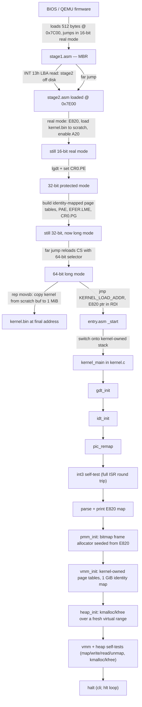
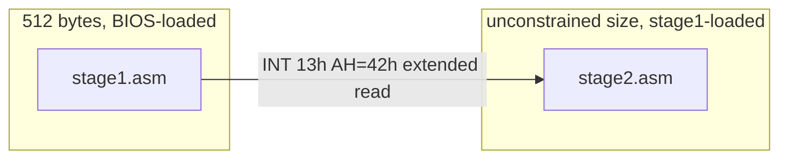
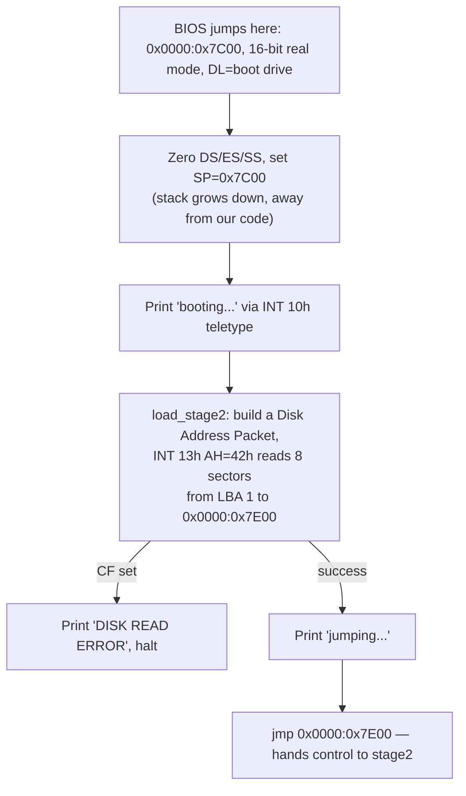
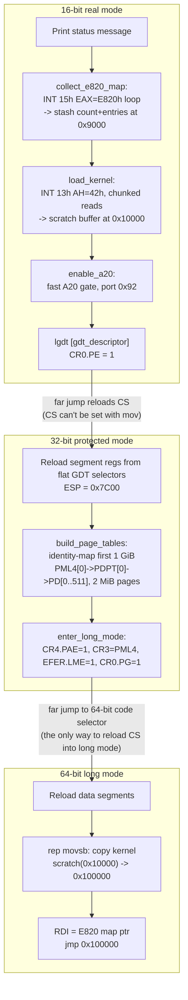
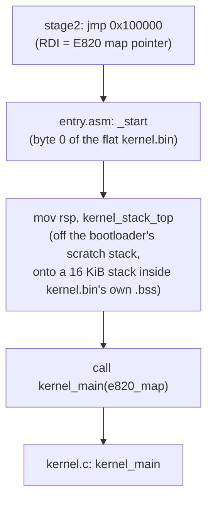
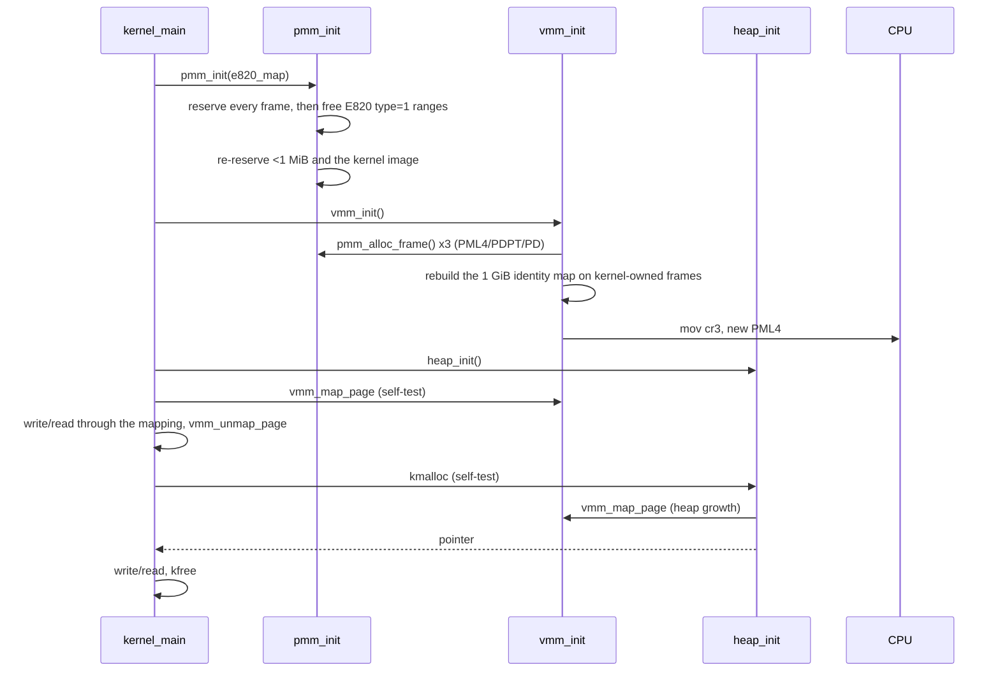
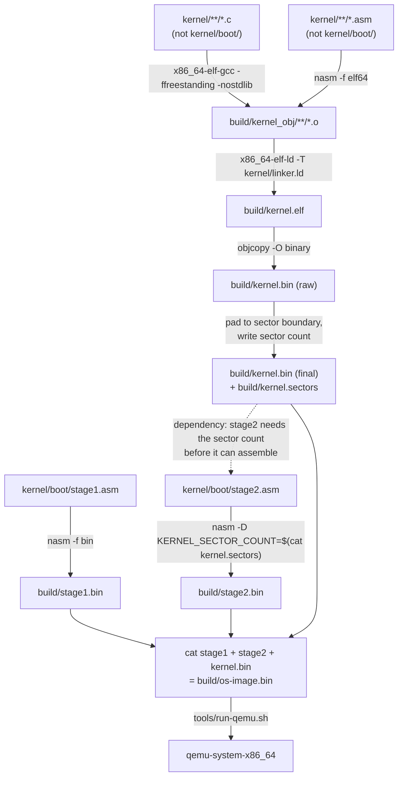

# Boot & kernel bring-up: the full flow

This is a tutorial-style walkthrough of everything that happens between
"QEMU powers on" and "the kernel halts after standing up memory
management" — i.e. everything built through **M5** (see
[milestones.md](../milestones.md)). It intentionally stops there rather
than trying to keep pace tutorial-section-by-tutorial-section with every
later milestone; `milestones.md`'s dated progress log is the up-to-date,
authoritative account of M6 onward (drivers/timer, scheduler, syscalls,
user mode, filesystem, shell, ...) - this doc's boot-to-memory-management
walkthrough stays valid background reading regardless of how far past it
the project has gone.
Each section has a diagram plus a "why" explanation: nothing here is
architecture for its own sake, every hop exists because of a concrete
hardware constraint. Read it top to bottom if you're new to OS dev; jump
to a section if you just need a refresher.

---

## 1. The big picture

Everything below is one of the boxes in this diagram, expanded.

---

## 2. Why two boot stages instead of one

A BIOS boot sector (the MBR) is exactly **512 bytes**, and the last two
of those are a fixed signature (`0xAA55`) — you get 510 bytes of code
and data. That is nowhere near enough to write a protected-mode →
long-mode transition, an E820 memory scan, and a disk loader capable of
pulling in a kernel of arbitrary, growing size.

So the standard approach — and what `lean_os` does — is to split the
job:

- **Stage 1** (`kernel/boot/stage1.asm`, [source](../kernel/boot/stage1.asm)): the 512-byte MBR itself. Its *only* job is
  "prove the disk works, read a bigger stage 2 into memory, jump to it."
- **Stage 2** (`kernel/boot/stage2.asm`, [source](../kernel/boot/stage2.asm)): not size-constrained (it's sized by
  the Makefile, currently 4 KiB), so it can afford the real bulk of the
  bootloader logic: memory map collection, A20, GDT, protected mode,
  paging, long mode, and loading+jumping into the actual kernel.

---

## 3. Stage 1: the MBR

**Why `INT 13h` extended reads (LBA) instead of classic CHS reads?**
Classic CHS addressing caps out at 63 sectors per track. Stage 2 is
fine at 4 KiB, but it in turn needs to load a *kernel* binary that will
only grow over time — CHS would silently become a ceiling on kernel
size. LBA addressing has no such cap, so both stages use it
consistently from day one rather than needing a rewrite later.

**Why print anything at all?** Two bytes of `int 0x10` calls are cheap
insurance: if stage1 never prints, you know the BIOS boot signature or
disk geometry is wrong before you've written a single line of stage2.
If it prints and then hangs, you know the bug is downstream. This is
the whole debugging strategy for the parts of the OS that exist before
any real diagnostics (VGA driver, panic handler) are available.

---

## 4. Stage 2: real mode → protected mode → long mode

This is the densest part of the codebase. The **order of operations is
dictated by hardware, not by the milestone checklist** — the comment
at the top of `stage2.asm` calls this out explicitly. The rule that
drives everything: **BIOS interrupts (`INT 13h`, `INT 15h`, `INT 10h`)
only work in real mode.** The instant you flip `CR0.PE`, they're gone
for good. So anything that needs the BIOS has to happen *first*.

### 4.1 Why E820 has to come before anything else

`INT 15h, EAX=E820h` asks the BIOS "what memory exists and what's its
type" (usable RAM, reserved, ACPI reclaimable, etc.) — this is the
*only* reliable source for that information short of hand-detecting
memory yourself. It's a BIOS call, so it must run while still in real
mode, before `CR0.PE` is touched. Once M5's physical frame allocator
exists, it will be seeded directly from this map — you can't hand out
a physical page as free RAM if you don't know it's RAM.

### 4.2 Why the kernel is loaded in two steps (scratch buffer, then copy)

Real mode addressing is `segment:offset`, which tops out at 1 MiB
(`0xFFFF:0xFFFF`). The kernel's *actual* home is 1 MiB
(`KERNEL_LOAD_ADDR = 0x100000`, matching [`linker.ld`](../kernel/linker.ld)) — real mode
literally cannot address that. So stage2:

1. Reads the kernel from disk into a real-mode-reachable **scratch
   buffer** at `0x10000` while still in real mode (`load_kernel`).
2. Later, once long mode is live and addressing is flat 64-bit,
   `rep movsb`s it from the scratch buffer up to `0x100000`.

The scratch buffer is capped at 64 KiB (one real-mode segment) with a
build-time `nasm %error` guard if `KERNEL_SECTOR_COUNT` ever exceeds
that — a deliberate, documented ceiling rather than a silent
truncation bug waiting to happen.

### 4.3 Why A20 needs to be enabled at all

On the original 8086, addresses wrapped at 1 MiB (20-bit address bus).
IBM PC/AT motherboards added a gate on address line 20 to preserve that
wraparound behavior for compatibility, and it defaults **off** at
power-on. With A20 off, any address ≥ 1 MiB silently wraps to the
low end of memory — which would corrupt the exact copy in §4.2. The
fast A20 gate (port `0x92`) is the quick, QEMU-and-most-real-hardware
method used here; keyboard-controller and BIOS fallbacks are noted as
a stretch-goal hardening pass for wider real-hardware support.

### 4.4 Why identity-mapped paging, and why 2 MiB pages

Enabling long mode *requires* paging to be on — there's no "paging-off
long mode." Since nothing about virtual memory management exists yet
(that's M5), the simplest correct thing is an **identity map**:
virtual address `X` maps to physical address `X`, for the first 1 GiB.
That keeps every address stage2 and the early kernel touch (scratch
buffer, kernel load address, VGA memory at `0xB8000`) valid without
having to reason about a real address space yet.

2 MiB "huge" pages are used instead of standard 4 KiB pages purely to
keep the page tables small: one PML4 entry → one PDPT entry → 512 PD
entries covers a full 1 GiB with three 4 KiB table pages total, versus
the thousands of 4 KiB pages a fully 4-KiB-granular identity map of
the same range would need. This gets revisited in M5 once real virtual
memory management (fine-grained mapping, W^X, unmapping) matters.

### 4.5 Why two far jumps, not `mov cs, ...`

`CS` (the code segment register) can't be loaded with a plain `mov` —
that's an x86 rule, not a choice made here. The only ways to reload it
are a far jump/call/return or an interrupt return. Stage2 needs *two*
mode transitions that each require a fresh `CS`:

- Real mode → protected mode: `jmp CODE32_SEL:protected_mode_entry`
- Protected mode → long mode: `jmp CODE64_SEL:long_mode_entry`

(The kernel's own GDT setup in M4 hits this same rule again — see §6.1.)

---

## 5. Kernel entry: from `_start` to `kernel_main`

**Why switch stacks immediately?** Up to this point, execution has
been running on whatever stack stage2 set up (`ESP = 0x7C00`) — memory
that belongs to the *bootloader*, not the kernel. Once M5's physical
frame allocator exists, it needs to know which pages are already
spoken for so it doesn't hand them out as free RAM. A stack living
inside the kernel's own linked image (`.bss`, reserved by `linker.ld`)
is memory the allocator can see and account for; the bootloader's
scratch stack is not. So the very first thing kernel code does is get
off borrowed memory and onto its own.

**Why does the kernel start at exactly 1 MiB?** `ENTRY(_start)` in
[`linker.ld`](../kernel/linker.ld) places `.text.entry` (and therefore `_start`) at byte 0 of
the linked, `objcopy`'d flat binary, and the SECTIONS block starts
at `. = 0x100000`. That constant has to match `KERNEL_LOAD_ADDR` in
stage2.asm exactly — it's the one address both the bootloader and the
kernel's own linker script have to agree on independently, which is
why it's called out in comments in both files.

---

## 6. `kernel_main`: CPU fundamentals (M4)

### 6.1 `gdt_init` — why the kernel needs its own GDT

Stage2 already built a GDT to get into protected/long mode (§4.5) —
but that one is bootloader-owned scratch data sitting in low memory
that M5's allocator will eventually want to reclaim. The kernel builds
its **own** GDT ([`gdt.c`](../kernel/arch/x86_64/gdt.c)) living inside its own image, with:

- A null descriptor (required by the architecture — selector 0 must
  fault if used).
- Flat 64-bit kernel code/data descriptors. In long mode, base/limit
  in these are mostly ignored by the CPU (addressing is already flat
  via paging) but they're still encoded for completeness.
- A **TSS descriptor**. In long mode the TSS isn't used for task
  switching (that's a legacy 32-bit feature) — it's used for exactly
  one thing right now: the **IST** (Interrupt Stack Table) mechanism.
  `tss.ist1` points at a dedicated 4 KiB `double_fault_stack`, and the
  IDT (§6.2) routes vector 8 (`#DF`, double fault) through IST1. That
  means a double fault caused by a *corrupt or overflowed kernel
  stack* still gets a known-good stack to push its exception frame
  onto — without IST1, that scenario is exactly how you get a silent
  **triple fault** (CPU can't push the frame → resets) instead of a
  diagnosable double-fault message.

`gdt_flush` has to do a song and dance to reload `CS`: same rule as
§4.5 (`mov cs` doesn't exist) applies here too, and a long-mode CPU
*also* can't encode a 64-bit target for a direct far jump. The
resolution (`gdt_asm.asm`) is the standard trick: push a far pointer
(segment selector + return address) onto the stack, then `o64 retf` —
a far *return* can pop a full 64-bit target, where a far *jump*
can't.

### 6.2 `idt_init` — why every one of the 256 vectors gets a gate

x86_64 reserves interrupt vectors 0–31 for CPU-defined exceptions
(divide-by-zero, page fault, double fault, ...) and the remaining
vectors are free for hardware IRQs and software use. `idt_init`
([`idt.c`](../kernel/arch/x86_64/idt.c)) installs a handler for all 32 exception vectors *and* the 16
(soon-to-be-remapped) IRQ lines — not just the ones the kernel
currently cares about. The reason: **an interrupt vector with no
gate installed is undefined behavior** — the CPU either triple-faults
or does something implementation-defined trying to service it. Wiring
every vector to *something*, even a generic "unhandled exception, dump
registers, panic," turns every possible fault into a diagnosable
message instead of a silent reset. This matters enormously for early
OS dev, where bugs routinely manifest as stray faults.

Each gate is an **interrupt gate** (`0x8E`: present, ring 0, 64-bit
interrupt gate) pointing at a small per-vector **stub**, not directly
at a C function — see §6.3 for why.

### 6.3 Why every vector needs its own assembly stub (`isr_asm.asm`)

Two things a CPU-taken interrupt does that C functions can't express:

1. **The CPU only pushes an error code for *some* exceptions** (Intel
   SDM Vol 3A §6.15) — e.g. `#GP` and `#PF` get one, `#DE` and `#BP`
   don't. That means the stack layout on entry differs vector to
   vector, but every vector needs to hand the *same* struct
   (`isr_regs_t`) to a single C dispatcher. The `ISR_NOERR` macro
   pushes a dummy `0` where the CPU didn't; `ISR_ERR` doesn't, since
   the CPU already did. After that, every path is uniform.
2. **`iretq`** (the instruction that resumes interrupted code,
   restoring `RIP`/`CS`/`RFLAGS`/`RSP`/`SS` from the exception frame)
   has no C equivalent — C has no way to describe "return from this
   function into a totally different, CPU-defined context."

So the flow per interrupt is: **tiny asm stub** (push vector +
error code, uniform now) → **shared `isr_common_stub`/`irq_common_stub`**
(saves all general-purpose registers, so the C handler can inspect —
and the CPU-pushed frame plus these form the complete `isr_regs_t`) →
**C handler** (`isr_handler`/`irq_handler` in [`isr.c`](../kernel/arch/x86_64/isr.c), real dispatch
logic, can safely call other C functions, print, panic, etc.) →
**restore registers, drop vector+error code, `iretq`**.

The register-dump struct layout in `isr.h` has to match the assembly
push order *exactly*, byte for byte — this is called out explicitly in
comments on both sides because a mismatch here wouldn't be a compile
error or an obvious crash, just silently wrong register values in
every dump and potentially a corrupted return.

### 6.4 `pic_remap` — why the PIC has to move before anything can use it

The 8259 PIC's **power-on default** maps IRQ0–15 to interrupt vectors
`0x08`–`0x0F`. Look back at §6.2: vector `0x08` is `#DF` (double
fault) and several others in that range are also CPU exceptions. Left
unmapped, a hardware IRQ (say, the timer) would look *identical* to a
CPU raising a double fault — completely ambiguous and undebuggable.
`pic_remap` ([`pic.c`](../kernel/arch/x86_64/pic.c)) reprograms both the master and slave 8259 (the
standard 4-byte ICW1–ICW4 initialization sequence, with `io_wait()`
delays between writes because the real chip needs settling time) to
land on vectors `0x20`–`0x2F` instead — clear of the CPU exception
range, matching where `idt_init` installed the 16 IRQ stubs.

After remapping, **every line is immediately masked** (`outb`
`0xFF` to both PIC data ports). No driver exists yet to handle a timer
tick or a keystroke, so an unmasked line firing right now would just
hit `irq_handler`'s generic "unhandled IRQ" path. `pic_set_mask` /
`pic_clear_mask` are already in place so M6's drivers can unmask their
one specific line as they come online, instead of turning everything
on at once.

### 6.5 The `int3` self-test — why prove it, not just trust it compiled

`kernel_main` deliberately executes `__asm__("int3")` right after the
three `_init` calls. `int3` (`#BP`, breakpoint) is the one exception
vector in `isr_handler` (§6.3, [`isr.c`](../kernel/arch/x86_64/isr.c)) that's treated as *recoverable* —
print and `return` instead of `panic`. That makes it the safe choice
for a smoke test that exercises the **entire** interrupt pipeline
end-to-end: IDT gate lookup → correct stub → correct stack frame →
`isr_common_stub` register save → C dispatch → register restore →
`iretq` back to the very next instruction. If any link in that chain
were wrong — a bad selector in the IDT entry, a mismatched register
layout, a broken `iretq` — this would triple-fault or hang instead of
printing "Resumed after breakpoint self-test." Getting a clean compile
proves the code is well-formed; this proves it's *correct*.

---

## 7. Memory management (M5)

### 7.1 `pmm_init` — a bitmap seeded from E820, then locked down

The E820 map (§4.1) says which physical ranges the BIOS reports as
usable RAM — but "the BIOS says it's usable" and "the kernel can safely
hand this out as a free frame" aren't the same claim. `pmm_init`
([`pmm.c`](../kernel/mm/pmm.c)) starts every frame in its bitmap marked
reserved, clears the bits for `type=1` E820 ranges, and then
**unconditionally** re-reserves two things regardless of what E820 said:

- Everything below 1 MiB — the real-mode IVT/BDA, the E820 map itself
  (`0x9000`), stage2's bootstrap page tables (`0x1000`-`0x4000`), the
  kernel's real-mode scratch load buffer (`0x10000`), and VGA text
  memory (`0xB8000`) — see §4's memory-map comment in `stage2.asm`.
- The kernel's own loaded image, `0x100000` through `__kernel_end`
  (`kernel/linker.ld`) — code, data, and `.bss` the kernel is currently
  running out of and storing state in.

Handing out either as a "free" frame would mean some future allocation
silently overwrites the kernel itself or the memory map it just read —
exactly the kind of bug that's invisible until something much later
mysteriously corrupts. Re-reserving explicitly, after the E820-driven
free pass, means the order of those two steps can't matter: no E820
quirk can un-reserve memory the kernel actually depends on.

The bitmap only covers `PMM_TRACKED_MEMORY` (1 GiB) — the same 1 GiB
`vmm_init` identity-maps (§7.2). A frame has to be addressable before
it can be handed out (page tables are themselves built from
pmm-allocated frames — see §7.2's `phys_to_table`), so there's no point
tracking physical memory beyond what's already mapped 1:1. Extending
past 1 GiB is future work for whoever needs more than that tracked.

### 7.2 `vmm_init` — the kernel takes ownership of paging, same pattern as the GDT

Stage2 already built page tables to get into long mode (§4.4) — fixed,
bootloader-owned scratch structures at `0x1000`/`0x2000`/`0x3000`, just
like the bootstrap GDT §6.1 replaced. `vmm_init` ([`vmm.c`](../kernel/mm/vmm.c)) does the
same hand-off for paging: it builds a fresh PML4/PDPT/PD out of frames
from `pmm_alloc_frame()`, rebuilds the *identical* 1 GiB, 2 MiB-page
identity map stage2 built, then loads the new table into `CR3`. Because
the new map covers exactly the same range the old one did, nothing the
kernel is currently executing or storing (code, stack, the page tables
being built) moves out from under it mid-switch.

`vmm_map_page`/`vmm_unmap_page` are the real payoff: a standard 4-level
page walk (`PML4` → `PDPT` → `PD` → `PT`) using 4 KiB pages, allocating
whichever intermediate tables don't exist yet from the PMM. Both check
for `PTE_HUGE` on the PD entry before descending into it as if it were
a pointer to a PT — without that guard, calling either function on an
address inside the 1 GiB identity range would misinterpret a 2 MiB
page's physical address as a page-table pointer and corrupt memory
instead of failing loudly.

**A load-bearing simplifying assumption**, called out in
`vmm.c`'s `phys_to_table`: every frame `pmm_alloc_frame()` can return
lives inside the 1 GiB that's always identity-mapped (bootstrap or
kernel-owned), so a physical address can be cast straight to a pointer
and dereferenced. That's what lets `vmm_init`/`vmm_map_page` write into
brand-new page tables without any special "temporarily map this frame
so I can edit it" dance. It stops being true the day physical memory
tracking or kernel mappings need to extend past 1 GiB — flagged there
for whoever does that work next.

### 7.3 `heap_init`/`kmalloc`/`kfree` — deliberately *not* riding the identity map

The kernel heap ([`heap.c`](../kernel/mm/heap.c)) starts at virtual
address `PMM_TRACKED_MEMORY` (1 GiB) — the first address *above* the
identity map, not inside it. That's a deliberate choice: if the heap
lived inside `[0, 1 GiB)`, every "allocation" would just be handing out
already-present identity-mapped memory, and `vmm_map_page` would never
actually be exercised by anything real. Starting the heap just past
that boundary means every page it grows into is a genuine, freshly
built mapping — physical address unrelated to virtual address, walked
and allocated by §7.2's machinery.

`kmalloc` is a first-fit search over a singly-linked free list of
`block_header_t` nodes (size, free flag, next). Two structural
invariants keep it simple:

- The list stays in **address order** by construction: splitting a
  block inserts the remainder immediately after it, and growing the
  heap only ever appends at the high end (`grow_heap` always starts
  from `heap_virt_end`). So "the next node" and "the next block by
  address" are always the same thing.
- That invariant is what makes `kfree`'s coalescing correct with only a
  *forward* merge (`b->next` is free and address-adjacent → merge) and
  no backward pointer to maintain. A block newly freed next to an
  already-free predecessor won't merge until *that* predecessor happens
  to be visited from its own `kfree` or a future split — an accepted
  simplification for a first pass, not a correctness gap (nothing is
  ever double-counted or lost, just not merged as eagerly as a
  doubly-linked design would).

When no free block fits, `grow_heap` maps enough whole pages via
`vmm_map_page`, each backed by a fresh `pmm_alloc_frame()` call — the
heap never unmaps a page on `kfree` (address space isn't reclaimed),
which is fine until something actually needs that memory back.

### 7.4 Two more self-tests, same discipline as `int3`

`kernel_main` proves this pipeline the same way §6.5 proved the
interrupt pipeline — round-trip it for real, don't just trust a clean
compile:

1. **vmm self-test**: `vmm_map_page` a throwaway virtual address to a
   fresh frame, write a magic 64-bit value through the mapping, read it
   back, `vmm_unmap_page` it. If the page walk, the `PRESENT`/`WRITABLE`
   bits, or the `invlpg` were wrong, this would fault or read back
   garbage instead of printing "map/unmap self-test passed."
2. **heap self-test**: `kmalloc` a block, write/read through it, `kfree`
   it. This exercises `vmm_map_page` again — through heap growth, a
   completely different call path than the direct test above — so a bug
   that only shows up when mapping is driven indirectly wouldn't hide
   behind the first test passing.

Verified via headless QEMU screendump and a `-d int,cpu_reset` log
showing exactly one interrupt for the whole boot (`v=03`, the
pre-existing `int3` test from §6.5) — no page faults, general
protection faults, or double/triple faults from the new paging code or
the `CR3` swap.

---

## 8. Build pipeline: how source becomes `os-image.bin`

Not runtime flow, but worth understanding since stage2 and the kernel
have a real *build-time* dependency on each other (§4.2's sector
count):

**Why does stage2 depend on the *built kernel binary*, not just its
source?** Stage2's `load_kernel` (§4.2) needs to know how many disk
sectors to read — a number that only exists once the kernel is
compiled, linked, and `objcopy`'d to a flat binary. The Makefile
captures that as a build-time constant
(`nasm -D KERNEL_SECTOR_COUNT=...`) computed from the actual file
size, rather than a hand-maintained number that would silently go
stale the moment the kernel grows. This is also why the Makefile rule
for `stage2.bin` lists `$(KERNEL_BIN)` as a prerequisite — Make has to
build the kernel *before* it can assemble stage2, even though nothing
about stage2's *source code* changed.

**Why `objcopy -O binary` instead of shipping the ELF?** The
bootloader has no ELF parser (that's what M9's "minimal ELF64 loader"
will add, for *user* programs) — it can only do a flat `rep movsb`
copy to a fixed address. `objcopy` strips away ELF's section headers,
program headers, and symbol tables, leaving just the raw bytes that
belong at `linker.ld`'s `. = 0x100000`, in order, starting at offset 0
— exactly what `entry.asm`'s "byte 0 is `_start`" assumption and
stage2's flat copy both require.

---

## 9. Where this leaves off

By the end of M4, the kernel owned its own segmentation (GDT/TSS) and
could safely take any CPU exception or hardware IRQ without undefined
behavior (IDT/ISR/PIC) — but memory management was still just the
bootstrap identity map stage2 built to get into long mode, with no way
to track which physical frames were actually free or map anything new.
M5 closes that gap: a physical frame allocator seeded from and
cross-checked against the E820 map (§7.1), kernel-owned page tables
with a real map/unmap API replacing stage2's bootstrap ones (§7.2), and
a kernel heap built on top of that API rather than riding the identity
map for free (§7.3) — each proven with its own self-test (§7.4) in the
same spirit as M4's `int3` round trip.

That's where this walkthrough's scope ends — timer/serial/keyboard
drivers, preemptive scheduling, syscalls, user mode, and everything after
build directly on top of the boot → GDT/IDT/PIC → memory-management
foundation laid out above, but are covered in `milestones.md`'s progress
log rather than as additional sections here. See
[milestones.md](../milestones.md) for the current state and what's next.
